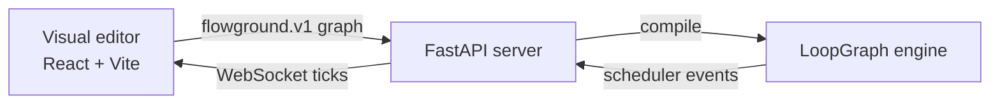

<p align="center">
  
</p>

<p align="center">
  <strong>Learn logic by drawing it.</strong><br>
  Build a flow, press Run, and watch every decision unfold.
</p>

<p align="center">
  <a href="#quick-start">Quick start</a> ·
  <a href="#how-it-works">How it works</a> ·
  <a href="PROTOCOL.md">Protocol</a> ·
  <a href="server/README.md">Backend</a>
</p>

<p align="center">
  <a href="LICENSE"></a>
</p>

---

[中文](README_zh.md)

Flowground is a visual flow-programming playground for learning and exploring logic.
Drag blocks onto a canvas, connect them into a graph, and follow the program as it runs
with live node highlights, animated edges, narrated output, and variable inspection.

The canvas is more than a simulation: every visible tick comes from the real
**[LoopGraph](https://github.com/S2thend/loopgraph)** scheduler running on the server.
That makes Flowground both a friendly learning environment and a visual debugger for
LoopGraph execution order.

## What you can build

- **Branching logic** with conditions and true/false paths
- **Loops and functions** with live variables and step-by-step execution
- **Parallel flows** using split and merge blocks
- **Nested workflows** with editable subgraphs
- **AI-assisted flows** with generate and judge blocks using your own provider key
- **Shareable artifacts** through JSON and LoopGraph + Python exports
- **Bilingual interfaces** in English and Chinese

## How it works



The browser sends a declarative `flowground.v1` graph—never executable code. The
backend compiles each block into a LoopGraph handler and evaluates expressions with an
AST allowlist. Execution events stream back over WebSocket so the canvas always reflects
the engine's real state.

| Layer | Technology | Location |
| :-- | :-- | :-- |
| Visual editor | React 18 + Vite | [`src/`](src/) |
| Run backend | Python 3.10+, FastAPI, uvicorn | [`server/`](server/) |
| Flow engine | LoopGraph | Server dependency |
| Wire contract | REST + WebSocket, `flowground.v1` | [`PROTOCOL.md`](PROTOCOL.md) |

> [!NOTE]
> The **LoopGraph + Python** export is a readable artifact for people. The client and
> server communicate with the `flowground.v1` graph format described in the protocol.

## Quick start

### 1. Start the backend

```bash
cd server
python3 -m venv .venv
.venv/bin/pip install -r requirements.txt
.venv/bin/python -m uvicorn app.main:app --reload --port 8000
```

### 2. Start the editor

In another terminal, from the repository root:

```bash
npm install
npm run dev
```

Open **http://localhost:5173**. Vite proxies API requests to the backend on port `8000`.

## Verify the project

Run the backend tests and create a production frontend build:

```bash
cd server && .venv/bin/python -m pytest tests -q
cd .. && npm run build
```

## Project map

```text
flowground/
├── src/             React editor, run client, styles, and translations
├── server/          FastAPI app, LoopGraph compiler, and backend tests
├── assets/          Project artwork
├── PROTOCOL.md      flowground.v1 wire protocol
└── vite.config.js   Frontend development and proxy configuration
```

## Further reading

- [`PROTOCOL.md`](PROTOCOL.md) — graph schema, endpoints, and run events
- [`server/README.md`](server/README.md) — backend setup and API routes

## Contributing

Contributions are welcome — see [`CONTRIBUTING.md`](CONTRIBUTING.md) for local setup and
PR guidelines.

## License

[MIT](LICENSE)
