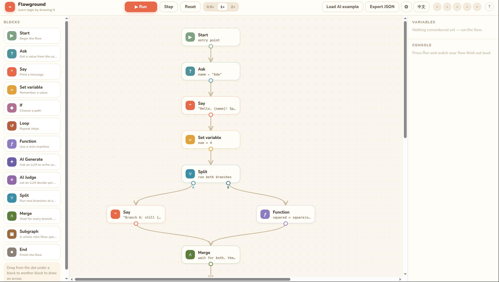
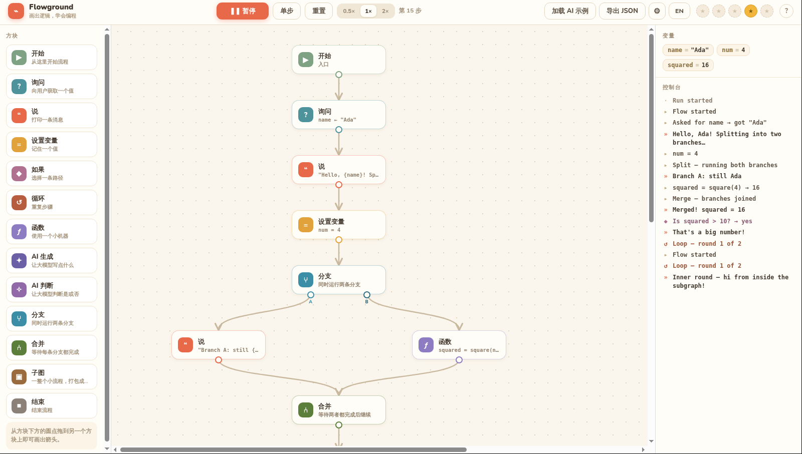
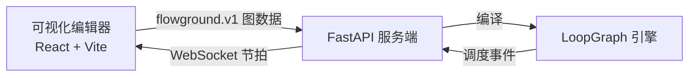

<p align="center">
  
</p>

<p align="center">
  <strong>画出逻辑，就是学会逻辑。</strong><br>
  搭建一个流程图，点击运行,看着每一个决策逐步展开。
</p>

<p align="center">
  <a href="#快速开始">快速开始</a> ·
  <a href="#工作原理">工作原理</a> ·
  <a href="PROTOCOL.md">协议文档</a> ·
  <a href="server/README.md">后端文档</a>
</p>

<p align="center">
  <a href="LICENSE"></a>
</p>

---

[English](README.md)

Flowground 是一个用于学习和探索逻辑的可视化流程编程演练场。
将模块拖到画布上，把它们连接成一张图,然后跟随程序运行——实时的节点高亮、
动态边、旁白式输出以及变量检查,一步步看清程序是如何执行的。

这不只是一个模拟器：画布上的每一个可见节拍，都来自服务端真实运行的
**[LoopGraph](https://github.com/S2thend/loopgraph)** 调度器。这让 Flowground
既是一个友好的学习环境,也是一个面向 LoopGraph 执行顺序的可视化调试器。

<p align="center">
  
</p>

<p align="center">
  
</p>

## 你可以搭建什么

- **分支逻辑**，包含条件判断和真/假两条路径
- **循环与函数**，带有实时变量和单步执行
- **并行流程**，使用拆分与合并模块
- **嵌套工作流**，支持可编辑的子图
- **AI 辅助流程**，使用你自己的服务商密钥调用生成与判断模块
- **可分享的产物**，支持导出为 JSON 以及 LoopGraph + Python 代码
- **双语界面**，支持中文与英文

## 工作原理



浏览器发送的是声明式的 `flowground.v1` 图数据——绝不是可执行代码。后端将每个
模块编译为一个 LoopGraph 处理器,并使用 AST 白名单来求值表达式。执行事件通过
WebSocket 实时流回前端，使画布始终反映引擎的真实状态。

| 层级 | 技术栈 | 位置 |
| :-- | :-- | :-- |
| 可视化编辑器 | React 18 + Vite | [`src/`](src/) |
| 运行后端 | Python 3.10+、FastAPI、uvicorn | [`server/`](server/) |
| 流程引擎 | LoopGraph | 服务端依赖 |
| 通信协议 | REST + WebSocket，`flowground.v1` | [`PROTOCOL.md`](PROTOCOL.md) |

> [!NOTE]
> **LoopGraph + Python** 导出是给人阅读的可读产物。客户端与服务端之间实际使用
> 协议文档中描述的 `flowground.v1` 图格式进行通信。

## 快速开始

### 1. 启动后端

```bash
cd server
python3 -m venv .venv
.venv/bin/pip install -r requirements.txt
.venv/bin/python -m uvicorn app.main:app --reload --port 8000
```

### 2. 启动编辑器

在另一个终端中，从仓库根目录执行：

```bash
npm install
npm run dev
```

打开 **http://localhost:5173**。Vite 会将 API 请求代理到 `8000` 端口的后端。

## 验证项目

运行后端测试并生成生产环境前端构建：

```bash
cd server && .venv/bin/python -m pytest tests -q
cd .. && npm run build
```

## 项目结构

```text
flowground/
├── src/             React 编辑器、运行客户端、样式与翻译文件
├── server/          FastAPI 应用、LoopGraph 编译器与后端测试
├── assets/          项目美术资源
├── PROTOCOL.md      flowground.v1 通信协议
└── vite.config.js   前端开发与代理配置
```

## 延伸阅读

- [`PROTOCOL.md`](PROTOCOL.md) — 图数据结构、接口与运行事件
- [`server/README.md`](server/README.md) — 后端搭建与 API 路由

## 贡献指南

欢迎贡献代码——本地环境搭建与 PR 规范请参见 [`CONTRIBUTING.md`](CONTRIBUTING.md)。

## 许可证

[MIT](LICENSE)
